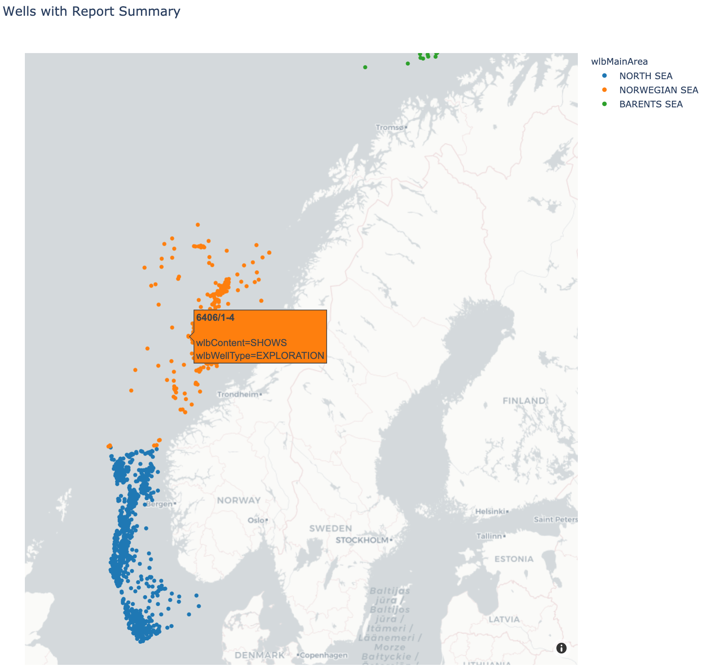
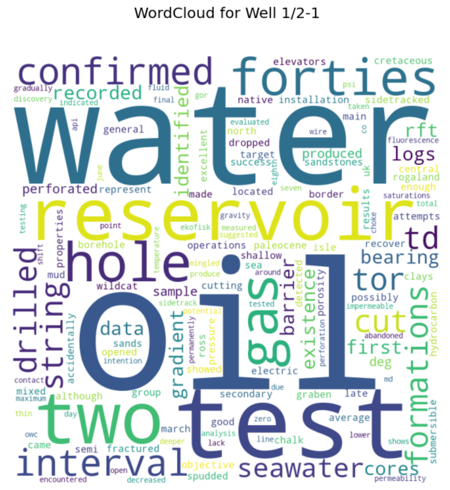
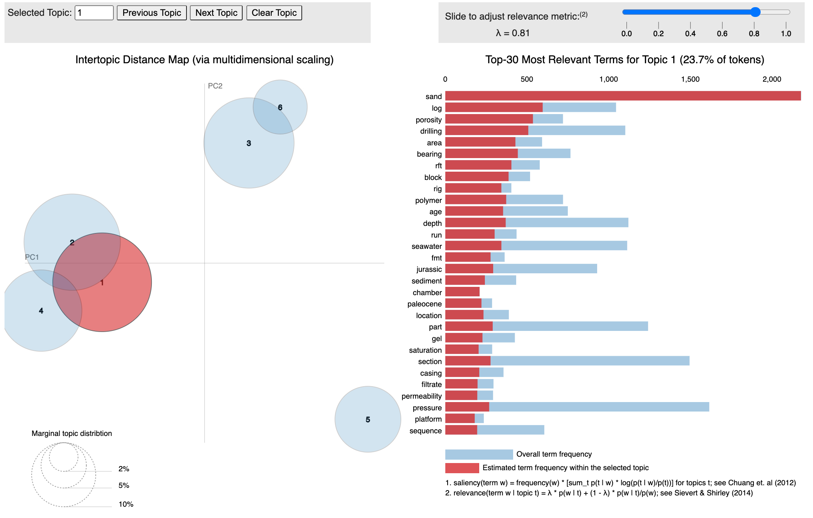

# NLP_Transform21

In this Jupyter Notebook, we will explore different aspects of NLP (Natural Language Processing). We will use well report summaries which are published by the NPD (Norwegian Petroleum Directorate), by requesting via an API. We will go through the different stages of text cleaning and formatting before moving on to NLP processing: tockenization, lemmatization and finally topic modeling.</br>
Please check out notebook here:</br>
```
/notebooks/NLP_transform21_v01.ipynb
```
Link to conference: [TRANSFORM 2021 conference](https://softwareunderground.org/transform-2021)

## In this notebook, we will go through the following steps:
- Get request to NPD wellbore tables via API, we are interested in:
 1) wells with coordinates (with-coordinates) and 
 2) wells with report summary (with-history)
- Reformating using pandas dataframes - merging of dataframe with coordinates together with dataframe with report summaries
- Visualisation on maps for QC and evaluation of how the data is distributed geographically (North Sea, Norwegian Sea, Barents)
- Cleaning of summaries (removing tags, etc)
- Pre processing for NLP (removing stopwords, tokenisation, lemmatization)
- Exploring wells with WordClouds
- Further NLP analysis: topic modeling and visualisation with pyLDAvis
- Conclusions, what to do next?

## Teasers!


<b>Topic modeling with pyLDAvis:</b><br>
<br>

