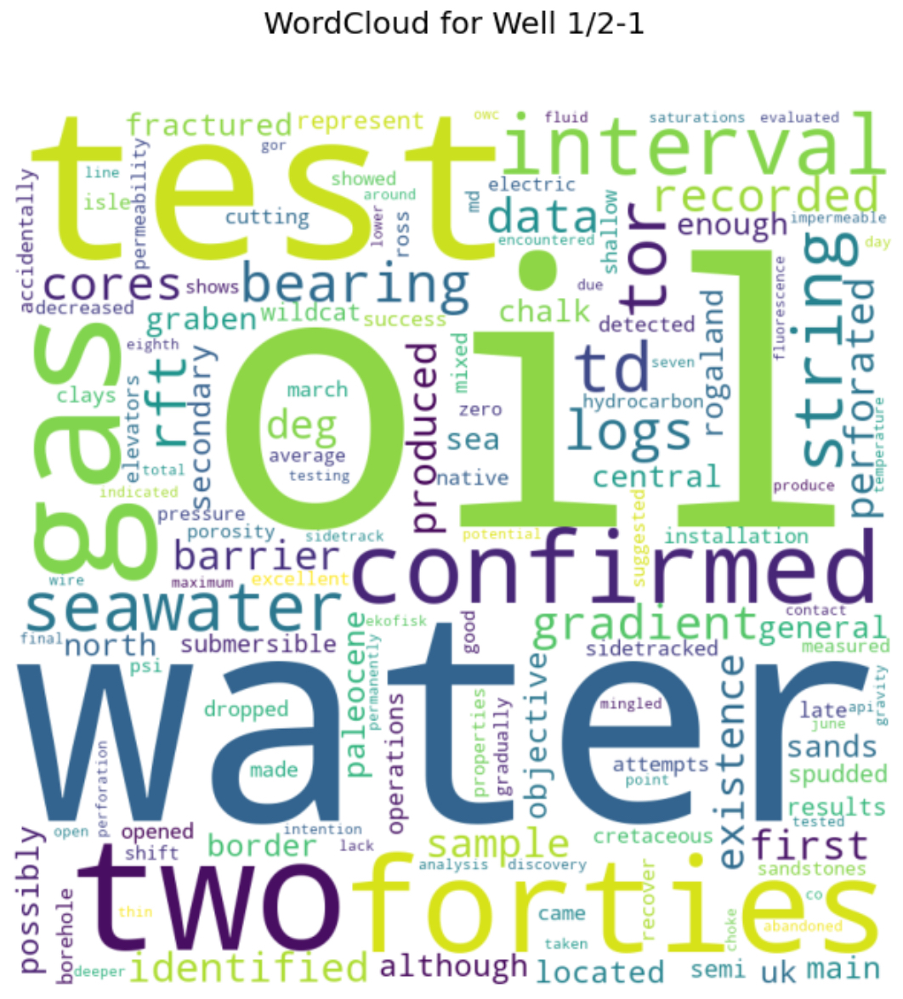

# NLP_Transform21

### UPDATE: 
I will post the final version of this notebook right before TRANSFORM 2021 conference, so check it out again mid April!

In this repo we will work with Wellbore report summaries from Norwegian Petroleum Directorate (NPD). 
The wellbore datasets are public domain and are available [here:](https://hotell.difi.no/?dataset=npd/wellbore/with-history) (well report summaries, link to API documentation).</br>
Please check out notebook here:</br>
```
/notebooks/NLP_transform21_v01.ipynb
```
Link to conference: [TRANSFORM 2021 conference](https://softwareunderground.org/transform-2021)

## In this notebook, we will go through the following steps:
- Get request to NPD wellbore tables via API, we are interested in:
 1) wells with coordinates (with-coordinates) and 
 2) wells with report summary (with-history)
- Reformating using pandas dataframes - merging of dataframe with coordinates together with dataframe with report summaries
- Visualisation on maps for QC and evaluation of how the data is distributed geographically (North Sea, Norwegian Sea, Barents)
- Cleaning of summaries (removing tags, etc)
- Pre processing for NLP (removing stopwords, tokenisation, lemmatization)
- Exploring wells with WordClouds
- Further NLP analysis: topic modeling and visualisation with pyLDAvis

## Teasers!


